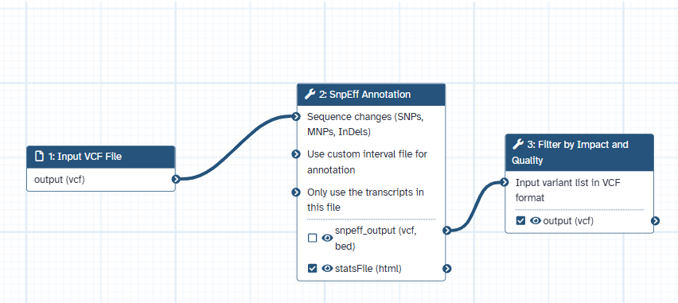

# Galaxy Variant Annotation and Filtering Workflow

[](https://galaxyproject.org/)
[](https://opensource.org/licenses/MIT)

A comprehensive Galaxy workflow for annotating and filtering genetic variants (SNPs and InDels) from VCF files using SnpEff and SnpSift. This workflow predicts functional impacts of variants and filters them based on impact severity and quality metrics to identify biologically significant mutations.



## Overview

This workflow takes variant calls in VCF format and processes them through a two-step pipeline:

1. **Annotation**: Using SnpEff to add comprehensive functional annotations that predict how variants might affect genes and proteins
2. **Filtering**: Using SnpSift to selectively retain variants based on their predicted impact and quality scores

The workflow helps researchers quickly identify potentially significant variants from large VCF files by focusing on those most likely to have biological consequences.

## Features

- Comprehensive annotation of variants using SnpEff's extensive databases
- Flexible filtering based on impact severity (HIGH/MODERATE/LOW/MODIFIER)
- Quality-based filtering to remove low-confidence variant calls
- Compatible with any reference genome available in SnpEff databases
- Generates both filtered VCF files and detailed HTML summary reports

## Requirements

- A Galaxy instance (public server like [usegalaxy.org](https://usegalaxy.org/) or local installation)
- The following tools installed on your Galaxy instance:
  - SnpEff (version 4.3+)
  - SnpSift (version 4.3+)
- Access to appropriate SnpEff databases for your reference genome

## Quick Start

1. **Import the workflow**:
   - Download the workflow file from `workflows/variant_annotation_filtering.ga`
   - In Galaxy, go to `Workflow → Import`
   - Upload the downloaded workflow file

2. **Run the workflow**:
   - Navigate to `Workflow → Run`
   - Select the imported workflow
   - Provide your input VCF file
   - Ensure the correct genome database is selected in the SnpEff step
   - Run the workflow

3. **Interpret the results**:
   - Review the SnpEff HTML report for annotation statistics
   - Examine the filtered VCF file for variants meeting your criteria

For detailed usage instructions, see [USAGE.md](docs/USAGE.md).

## Workflow Steps

1. **Input**: VCF file containing variant calls
2. **Annotation with SnpEff**:
   - Adds functional annotations to each variant
   - Predicts impact on genes and proteins
   - Generates a detailed HTML report
3. **Filtering with SnpSift**:
   - Filters variants based on customizable criteria
   - Default filter retains HIGH/MODERATE impact variants with QUAL > 30
4. **Output**:
   - Annotated and filtered VCF file
   - SnpEff HTML summary report

## Example Filter Expressions

The workflow uses SnpSift to filter variants. Here are some useful filtering expressions:

```
# High or moderate impact variants
(ANN[*].IMPACT has 'HIGH') || (ANN[*].IMPACT has 'MODERATE')

# High impact variants with quality > 30
(ANN[*].IMPACT has 'HIGH') && (QUAL > 30)

# Loss-of-function variants
(ANN[*].EFFECT has 'stop_gained') || (ANN[*].EFFECT has 'frameshift_variant')

# Variants in specific genes
(ANN[*].GENE has 'BRCA1') || (ANN[*].GENE has 'BRCA2')
```

For more examples, see [EXAMPLES.md](docs/EXAMPLES.md).

## Customization

You can customize this workflow by:

- Changing the SnpEff genome database to match your reference genome
- Modifying the filter expression to target specific variant types
- Adding additional preprocessing or post-processing steps

## Troubleshooting

See [TROUBLESHOOTING.md](docs/TROUBLESHOOTING.md) for solutions to common issues.

## Citation

If you use this workflow in your research, please cite:

```
Author, A. (2025). Galaxy Variant Annotation and Filtering Workflow. GitHub. https://github.com/yourusername/galaxy-variant-annotation-workflow
```

Also cite the tools used:

- SnpEff: Cingolani P, et al. A program for annotating and predicting the effects of single nucleotide polymorphisms, SnpEff. Fly (Austin). 2012 Apr-Jun;6(2):80-92.
- Galaxy: Afgan E, et al. The Galaxy platform for accessible, reproducible and collaborative biomedical analyses: 2018 update. Nucleic Acids Res. 2018 Jul 2;46(W1):W537-W544.

## License

This workflow is licensed under the [MIT License](LICENSE).

## Contributing

Contributions are welcome! Please feel free to submit a Pull Request.